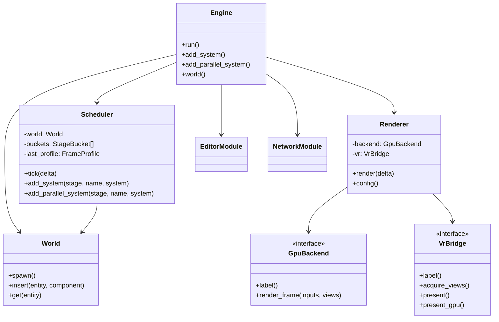
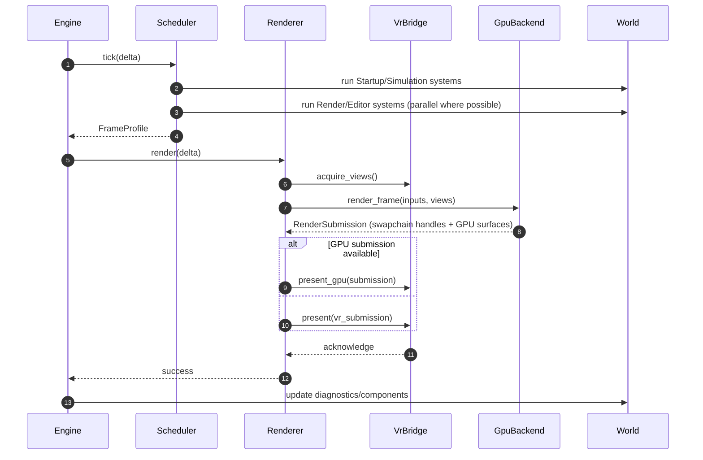
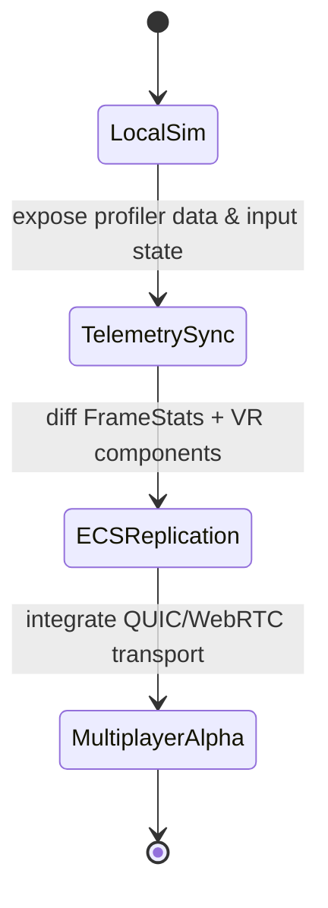

# Theta Engine System Architecture Diagrams

**Doc Guide:**
- For full system overview, see [Architecture](architecture.md).
- For protocol and schema details, see [Network Protocol Schema Plan](network_protocol_schema_plan.md).
- For roadmap and telemetry context, see [INDEX](INDEX.md) and [Phase 5 Parallel Plan](phase5_parallel_plan.md).

This document captures high-level UML-style views of the Theta Engine. Diagrams are authored in [Mermaid](https://mermaid.js.org/) so they can be rendered directly in supporting tooling.

## Module Overview



## Frame Execution Flow



## Data Flow: VR Input Sampling

```mermaid
graph TD
    subgraph Providers
        Simulated[SimulatedInputProvider]
        OpenXR[OpenXrInputProvider]
    end
    Providers --> MutexInput[Shared VrInputProvider]
    MutexInput -->|sample(delta)| Engine
    Engine --> Scheduler
    Scheduler --> World
    World -->|update| Head[TrackedPose]
    World --> Left[ControllerState (L)]
    World --> Right[ControllerState (R)]
    World --> Stats[FrameStats]
    Stats --> Renderer
    Stats --> Editor
```

## Networking Integration Roadmap



These diagrams will evolve as the engine matures. Update them alongside major architectural shifts to keep the visualization aligned with the implementation.
